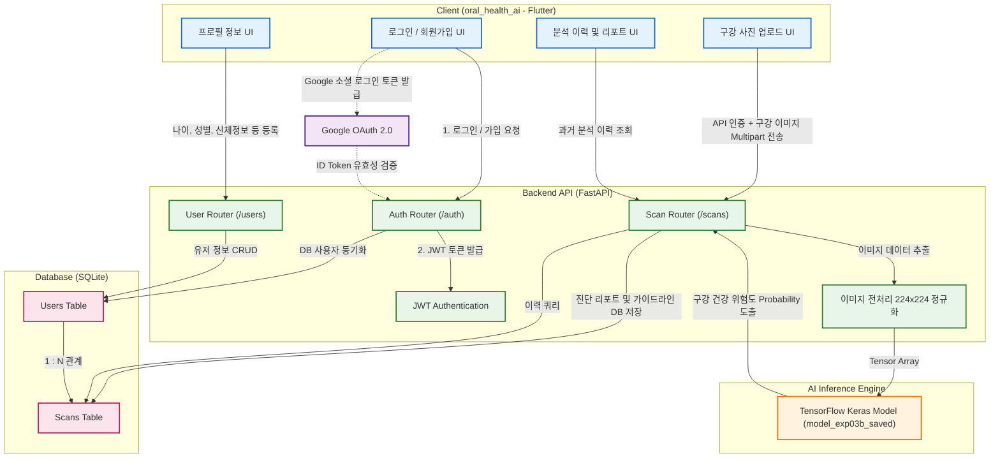

# 🦷 OraQ - Oral Health AI Diagnosis App

<div align="center">
  
  
  
  
</div>

## 📌 Project Overview
**OraQ**는 인공지능 영상 분석을 통해 사용자의 구강 사진을 분석하고, 위험도(Risk / Caution / Normal)를 예측하여 스마트한 구강 건강 가이드를 제공하는 애플리케이션입니다.

멋쟁이사자처럼(Likelion) 프로젝트의 일환으로 제작되었으며, Flutter를 통한 크로스 플랫폼 클라이언트와 FastAPI/TensorFlow로 강력한 진단 추론 서버를 제공합니다.

---

## 🏗 System Architecture

OraQ 프로젝트의 전체 시스템 아키텍처 다이어그램입니다.



---

## 💻 Tech Stack 종합

### Frontend (App)
*   **Framework**: Flutter (Dart)
*   **Platforms**: Web, iOS, Android 지원

### Backend (API Server)
*   **Framework**: FastAPI (Python)
*   **Auth**: JSON Web Tokens (JWT) & Google OAuth2
*   **Database**: SQLite (`oraq_app.db`) + SQLAlchemy ORM
*   **Deployment**: Local Backend 및 Hugging Face Spaces 대응 구조

### AI / Data Science
*   **Model Format**: TensorFlow 2.x `SavedModel` (`model_exp03b_saved`)
*   **Image Processing**: Pillow & Numpy 연산을 통한 224x224 RGB 정규화 (전처리)

---

## 📂 Repository Structure

```text
likelion/
├── backend/                  # 로컬 환경용 FastAPI 백엔드 (메인)
│   ├── main.py               # 진입점 및 전체 API 라우터
│   ├── model_exp03b_saved/   # TensorFlow 서빙 가능 AI 모델
│   └── oraq_app.db           # SQLite DB
├── hf_oraq_backend/          # Hugging Face 클라우드 배포용 구성
│   ├── app.py                # 포팅된 API 서버
│   └── Dockerfile            # 클라우드 호환을 위한 컨테이너라이징
├── oral_health_ai/           # 애플리케이션 프론트엔드 (Flutter)
│   ├── lib/                  # Dart UI 비즈니스 로직
│   └── pubspec.yaml          # 패키지 매니저
└── docs/                     # 프론트엔드 Web 정적 빌드 결과물 (GH Pages 배포용)
```
