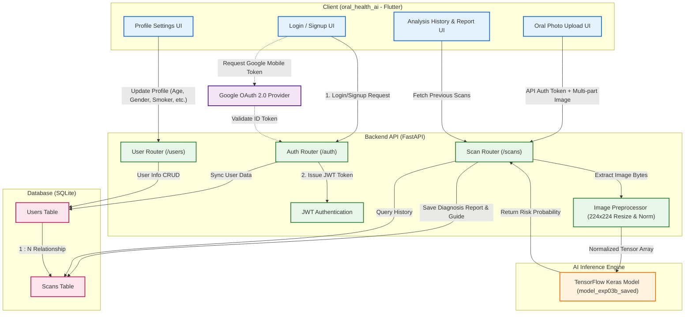

# 🦷 OraQ - Oral Health AI Diagnosis App

<div align="center">
  
  
  
  
</div>

## 📌 Project Overview
**OraQ** is an intelligent application providing smart oral health guides by analyzing users' dental photos to predict risk levels (Risk / Caution / Normal).

Developed as part of the Likelion project, it features a cross-platform client built with Flutter and a powerful, reliable AI diagnosis backend powered by FastAPI and TensorFlow.

---

## 🏗 System Architecture

The overarching system architecture diagram for the OraQ project.



---

## 💻 Tech Stack Summary

### Frontend (Application)
*   **Framework**: Flutter (Dart)
*   **Platforms**: Web, iOS, Android support

### Backend (API Server)
*   **Framework**: FastAPI (Python)
*   **Auth**: JSON Web Tokens (JWT) & Google OAuth2
*   **Database**: SQLite (`oraq_app.db`) + SQLAlchemy ORM
*   **Deployment**: Supports Local Backend and Hugging Face Spaces porting

### AI / Data Science
*   **Model Format**: TensorFlow 2.x `SavedModel` (`model_exp03b_saved`)
*   **Image Processing**: 224x224 RGB normalization using Pillow and Numpy operations

---

## 📂 Repository Structure

```text
likelion/
├── backend/                  # Local environment FastAPI backend (Main)
│   ├── main.py               # Entry point and global API router
│   ├── model_exp03b_saved/   # TensorFlow serving AI model directory
│   └── oraq_app.db           # SQLite DB for Users & Scans
├── hf_oraq_backend/          # Cloud deployment configuration for Hugging Face
│   ├── app.py                # Ported API Server
│   └── Dockerfile            # Containerization configuration
├── oral_health_ai/           # Cross-platform application frontend (Flutter)
│   ├── lib/                  # Dart UI & business logic
│   └── pubspec.yaml          # Package configurations
└── docs/                     # Static Web build output (for GitHub pages deployment)
```
